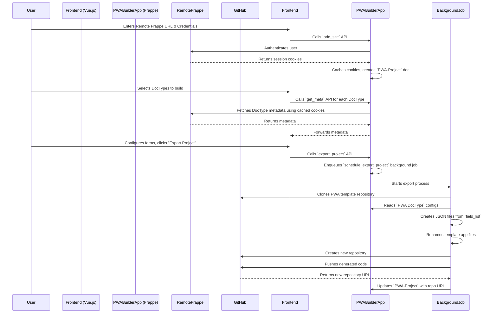

# Architectural Review and Improvement Plan: PWA Builder

This report provides a comprehensive architectural review and code audit of the `pwa_builder` Frappe module. The analysis covers performance, code quality, security, and extensibility, offering actionable recommendations for improvement.

## 1. High-Level Architectural Overview

The following diagram illustrates the current workflow of the PWA Builder module, from user authentication to project export.

---

## 2. Performance Optimization

### Finding 1: Inefficient Remote API Calls in `get_meta`
*   **Impact:** The `get_meta` function makes a separate HTTP request to the remote Frappe instance for every DocType. This will be slow and inefficient if a project includes many DocTypes, leading to a poor user experience.
*   **Recommendation:** Create a new whitelisted method on the remote Frappe instance (or suggest creating a small helper app on the remote instance) that can accept a list of DocTypes and return all their metadata in a single API call. This would reduce network latency significantly.

### Finding 2: Redundant Caching Logic
*   **Impact:** The `get_cookies` function includes logic to fetch and cache cookies. However, the `add_site` function *also* caches cookies separately. This creates redundant code and potential for stale cache issues.
*   **Recommendation:** Consolidate all cookie fetching and caching logic into the `get_cookies` function. The `add_site` function should call `get_cookies` with `force=True` to ensure fresh authentication and caching upon initial setup.

### Finding 3: Blocking File I/O and Git Operations
*   **Impact:** The `schedule_export_project` function performs numerous blocking operations: cloning a git repository, writing multiple JSON files, and pushing to a remote repository. While it runs in a background job, these operations can still be slow and consume significant server resources, potentially affecting other background jobs.
*   **Recommendation:** Break down the export process into smaller, more granular background tasks. For example, one job for cloning, another for file generation, and a final one for pushing to GitHub. This would improve resilience and allow for better progress tracking.

---

## 3. Code Quality & Maintainability

### Finding 1: Business Logic Misplacement
*   **Impact:** The vast majority of the business logic resides in `api.py` and the `pwa_github_integration.py` controller, while the DocType classes (`PWAProject`, `PWADocType`) are empty. This violates the principle of encapsulation and makes the code difficult to understand, maintain, and extend.
*   **Recommendation:** Refactor the code to move the relevant logic into the corresponding DocType classes. For example, the logic for creating and pushing a GitHub repository from `pwa_github_integration.py` should be methods within the `PWAGitHubIntegration` class. The `export_project` logic should be a method of the `PWAProject` class.

### Finding 2: Storing Form Definitions as JSON
*   **Impact:** The `field_list` in the `PWA DocType` is a large JSON blob. Storing structured data in this manner prevents proper database indexing, makes querying for specific fields impossible, and increases the risk of data corruption.
*   **Recommendation:** Create a new child DocType called "PWA Form Field" with fields for `fieldname`, `fieldtype`, `label`, `options`, `reqd`, etc. Replace the `field_list` JSON field with a Table MultiSelect field linking to this new child DocType. This will normalize the data, improve query performance, and make the form builder UI much more robust.

### Finding 3: Lack of Error Handling and Logging
*   **Impact:** The code has minimal error handling. For instance, in `push_to_github`, a failed API call to GitHub might not be logged with sufficient detail, making debugging difficult.
*   **Recommendation:** Implement comprehensive `try...except` blocks around all external API calls and file system operations. Use `frappe.log_error` to record detailed tracebacks. Provide clear, user-friendly error messages back to the client.

---

## 4. Customizability & Extensibility

### Finding 1: Monolithic Export Process
*   **Impact:** The `schedule_export_project` function is a single, monolithic block of code. If a developer wanted to add a custom build step (e.g., running a linter, compressing images), they would have to modify this function directly, which is not ideal.
*   **Recommendation:** Introduce custom Frappe hooks at key stages of the build process. For example:
    *   `before_pwa_export`
    *   `after_pwa_file_generation`
    *   `before_pwa_github_push`
    This would allow other apps to easily extend the build pipeline without altering the core code.

---

## 5. Security

### Finding 1: Storing Credentials in Plaintext
*   **Impact:** The `password` field in `PWA-Project` and the `access_token` in `PWA GitHub Integration` use the `Password` fieldtype, but the values are still stored in the database. Anyone with database access can retrieve these credentials. This is a critical security vulnerability.
*   **Recommendation:** Do not store the remote Frappe password at all. Instead, authenticate once to get the API key and secret for the user, and store those instead. For the GitHub access token, it should be encrypted before being stored in the database, and decrypted only when needed. Frappe's `frappe.utils.password.encrypt` and `frappe.utils.password.decrypt` can be used for this.

### Finding 2: Overly Permissive Whitelisted Methods
*   **Impact:** Several whitelisted methods, such as `add_site` and `get_meta`, have `allow_guest=True`. This means any unauthenticated user can make requests to these endpoints, potentially probing for information or attempting to create projects.
*   **Recommendation:** Remove `allow_guest=True` from all methods that should only be accessible to logged-in users. Enforce standard Frappe role permissions to ensure only authorized users can create and manage PWA projects.